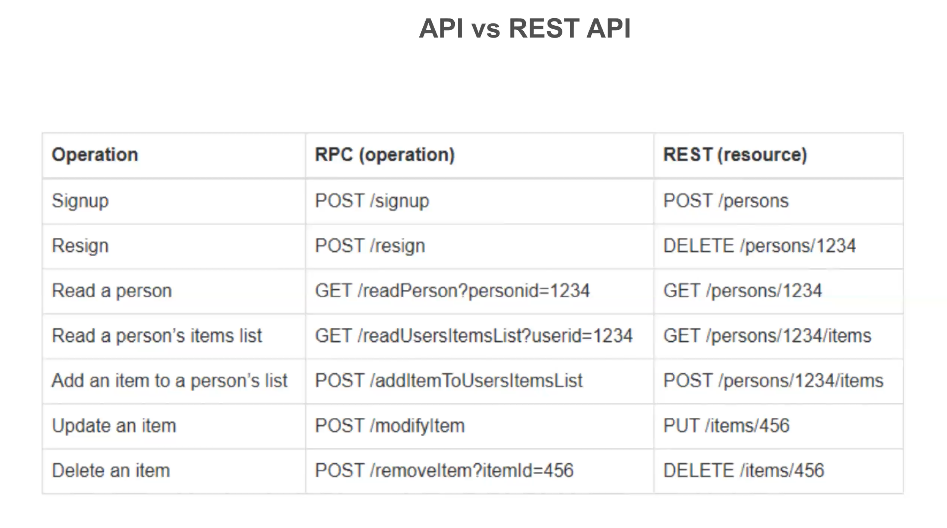
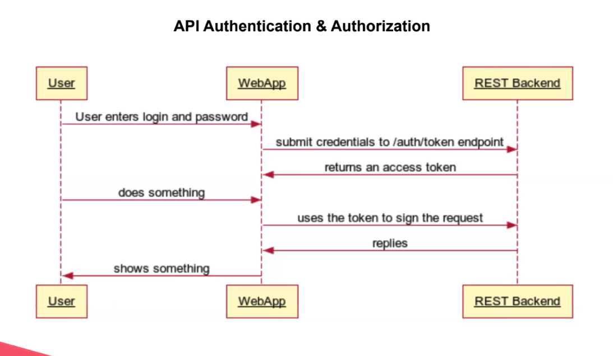
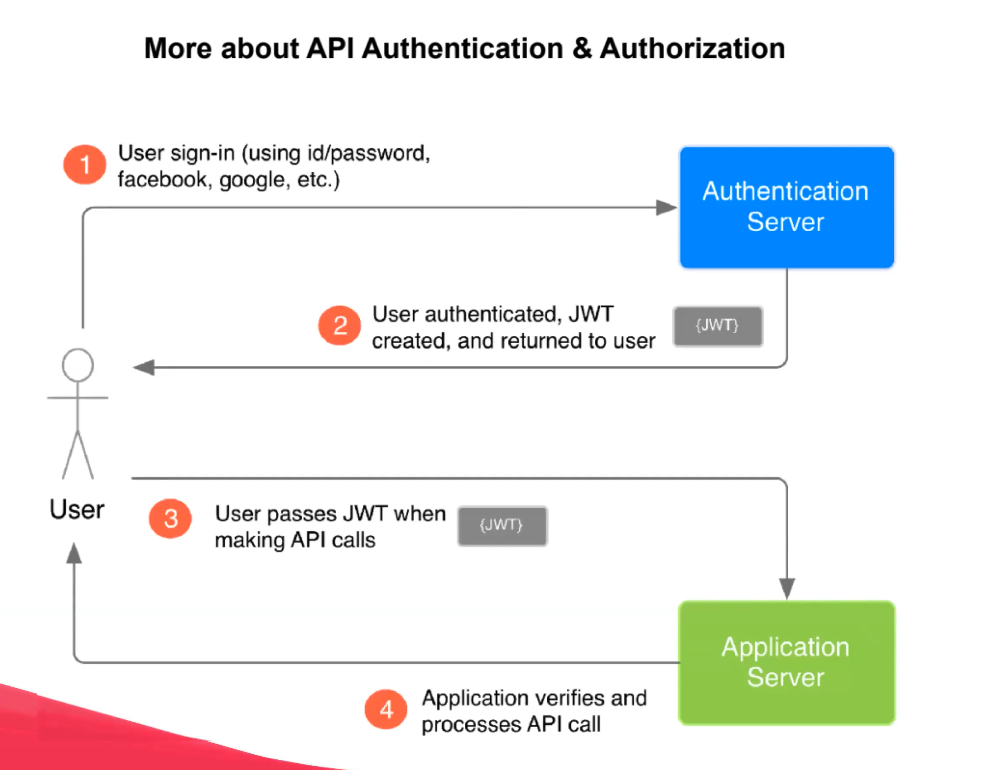

Passport is authentication middleware for Node: http://www.passportjs.org/
====第一个45分钟====
讲解this

setTimeout(function (name) {  
  this.name = name 
	console.log(this.name)
},1000); //setTimeout本身是要求一个匿名没有参数的function，所以name是undefined不会被调用的，undefined. 

setTimeout((name)=>{ this.name = name )})

 setTimeout((name)=>{ this.name = name )},1000)

setTimeout((name)=>{ this.name = getName() )})

setTimeout((name)=>{ this.name = this.getName() )})

上一节课的note讲解得明明白白的

Class是类，一个模板.

Instance是实例，一般是从Class new出来的
    
    if (cat Instanceof Cat) consolo.log("it is a cact") 
javascript 是动态语言，所以new的时候就算参数不传也不会报错

polymophysm和inheritance
es6里比较简单，子类的同名字function自动覆盖从继承父类的function。
更多例子： https://blog.csdn.net/w1019945543/article/details/78247541
        
        // OOP, Polymorphism

        class Pet{
         hello(){}
        }

        class Cat extends Pet {
            constructor(name, age){
                super();// 必须首先调用 super, 才能使用 this
                this.name = name;
                this.age = age;
            }

            hello(){
                console.log(`I'm cat and my name is: ${this.name} and my age is: ${this.age}`);
            }
        }

        class Dog extends Pet {
            constructor(name, age){
                super();
                this.name = name;
                this.age = age;
            }

          hello(){
            console.log(`I'm dog and my name is: ${this.name}           and my age is: ${this.age}`);
           }
        }

        const cat =  new Cat();
        const dog =  new Dog();

        cat.hello();
        dog.hello();

        const cat1 =  new Cat('kitty', 2);
        const dog1 =  new Dog('puppy', 3);

        cat1.hello();
        dog1.hello();

==第二个45分钟==
JSON: JavaScript Object Notation
    + a data format uses key-value pairs
    + commonly used for asynchronous browser-server communication
    +JSON的格式非常严格, key一定要是被“”包裹的，且不认''。

javascript版
    
    const cat = {
        name: 'xyxy',
        age: 4, //最后一个可以加, 
    }

JSON
    {
        "name": "Leon",
        "age": 123,
        "animal": true.
        "legs":["fist","second"]
    }

Javascript JSON 转换

    const catString = JSON.sttringify(cat);
    const cat1 = JSON.parse(caatString);

    'use strict';

    // Node.js 引入 JSON 文件，自动解析成 JS Object, 注意这里的 `./` 相对路径
    const cat = require('./cat.json');

    // 序列化为字符串
    const catString = JSON.stringify(cat);
    console.log(catString);
    // 解析为 JS Object
    const cat1 = JSON.parse(catString);
    console.log(cat1);

    const dog = {
    name: 'puppy',
    age: 4,
    };

    const dogString = JSON.stringify(dog);
    console.log(dogString);
    const dog1 = JSON.parse(dogString);
    console.log(dog1);

API

+ RPC在实际使用中，以前后端开发为例，前端传递一个方法名和参数给后端，后端执行对应的方法，并给该方法传递对应的参数，最后将执行的结果传递给前端。

+ REST在设计API时，使用路径定位资源，方法(get,put,post,delete)定义操作，通过Content-Type和Accept来协商资源的类型。设计的时候先确认state就很好做了。

    + REST是无状态的，请求之间没有持久的会话信息
    + 响应需要声明成可缓存的
    + REST关注一致性，如果使用HTTP，需要尽可能使用HTTP的特性，而不是去发明新的公约

 

 ==第三个45分钟==
 微服务 是用来拆开大project来支持多团队开发的。
 通常用RPC,Restful这两种沟通协议支持分工合作。
 

API Authentication & Authorization

- Authentication: verify who you are

- Authorization: verify what you can do

可以用UML来梳理User WebAPP RESTBackend 之间的交换
授权流行使用JWT（JSon web token）

 
 
 
 homework
 : www.developers.google.com/map/documentation/direction/start
1.read and understand the json format
2.create get method url for route from sunnybank to brisbane CBD
    1. distance and time for travvel(driving)
    2. Time for travel consider congestion in 9am weekday and sunday(driving)
    3. public transport with lowest walking distance

: Tesltra messaging api
    www.dev.telstra.com/content/messaging.api